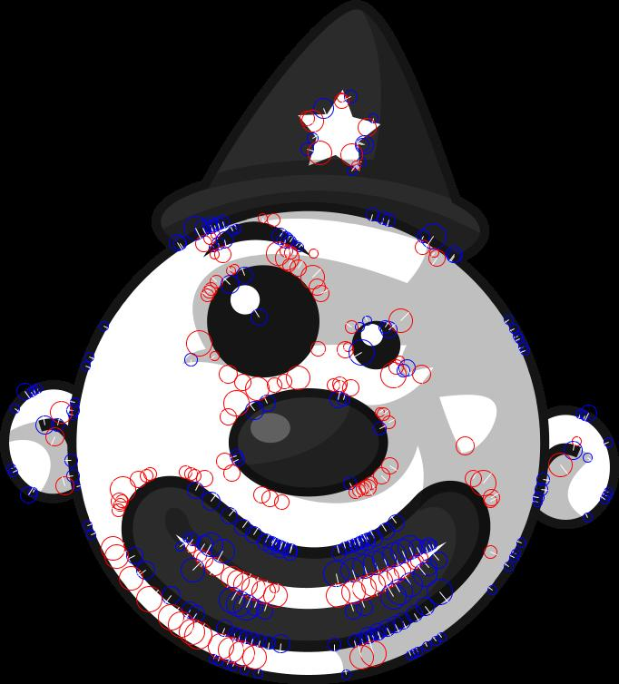
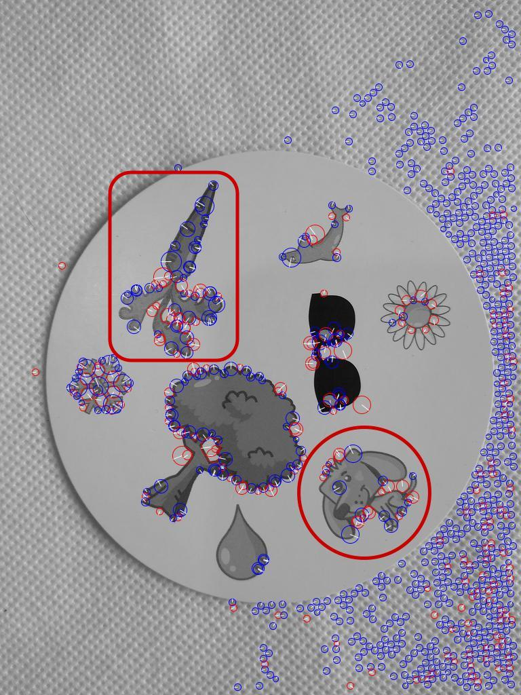
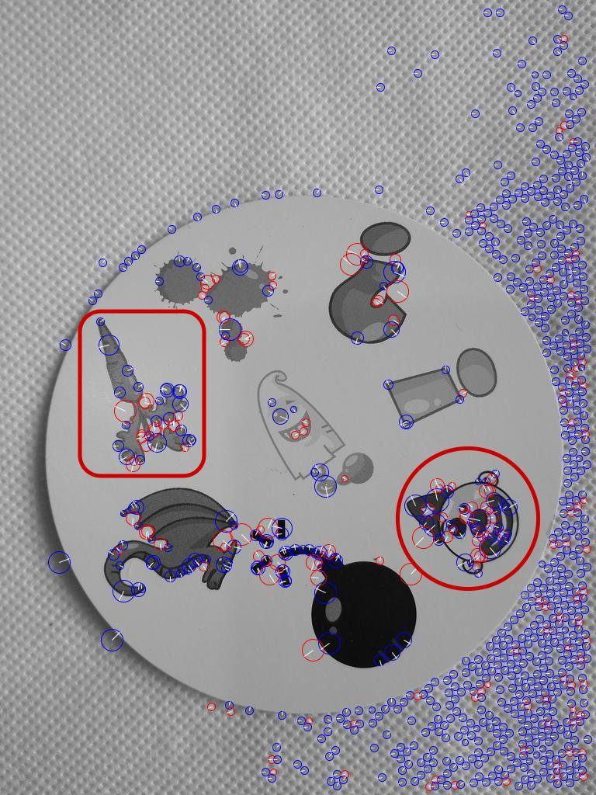
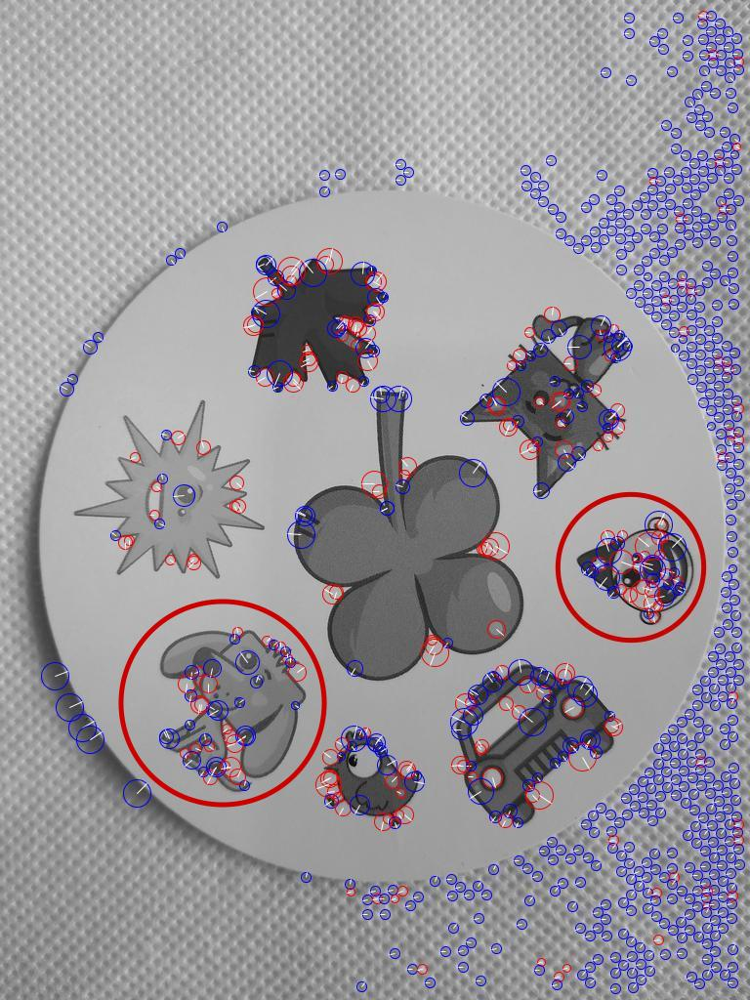
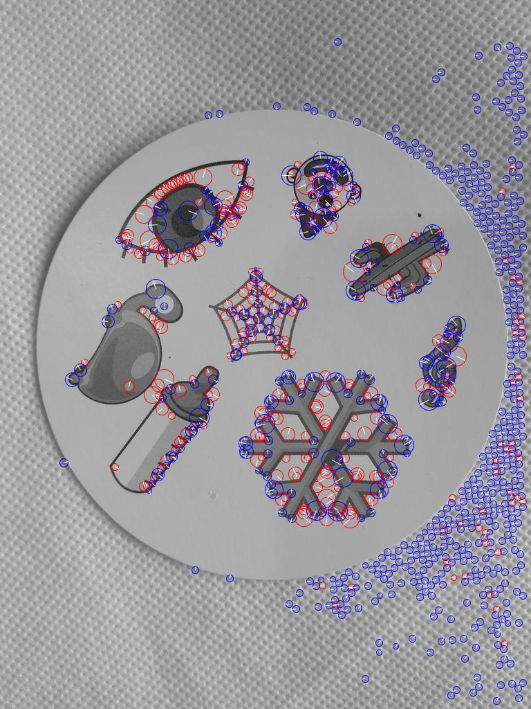
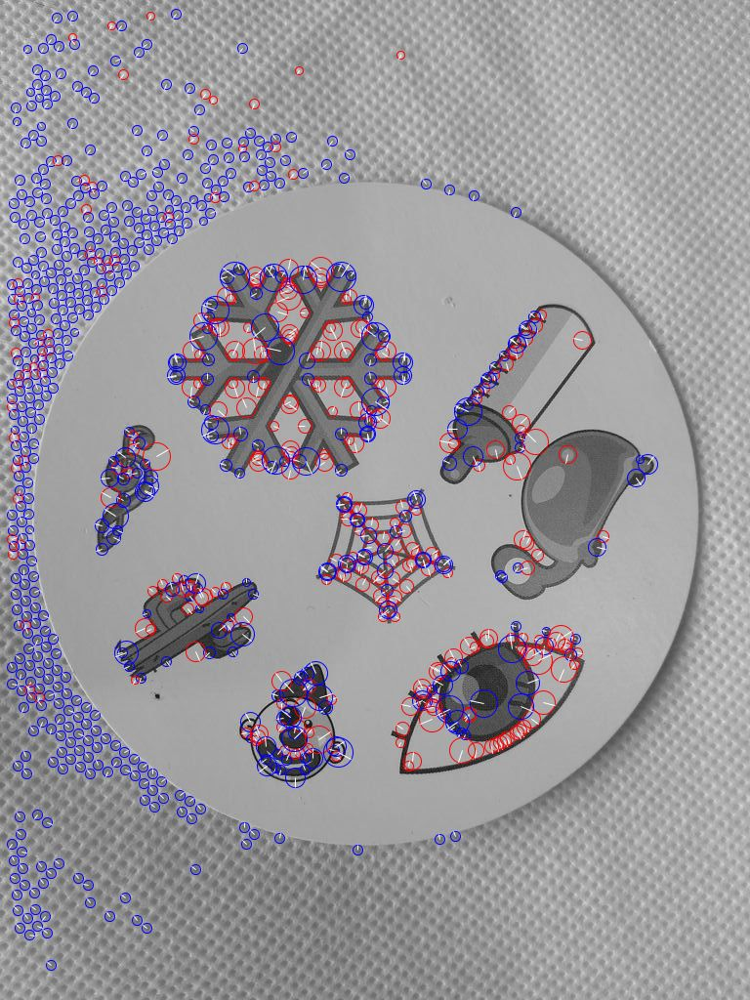
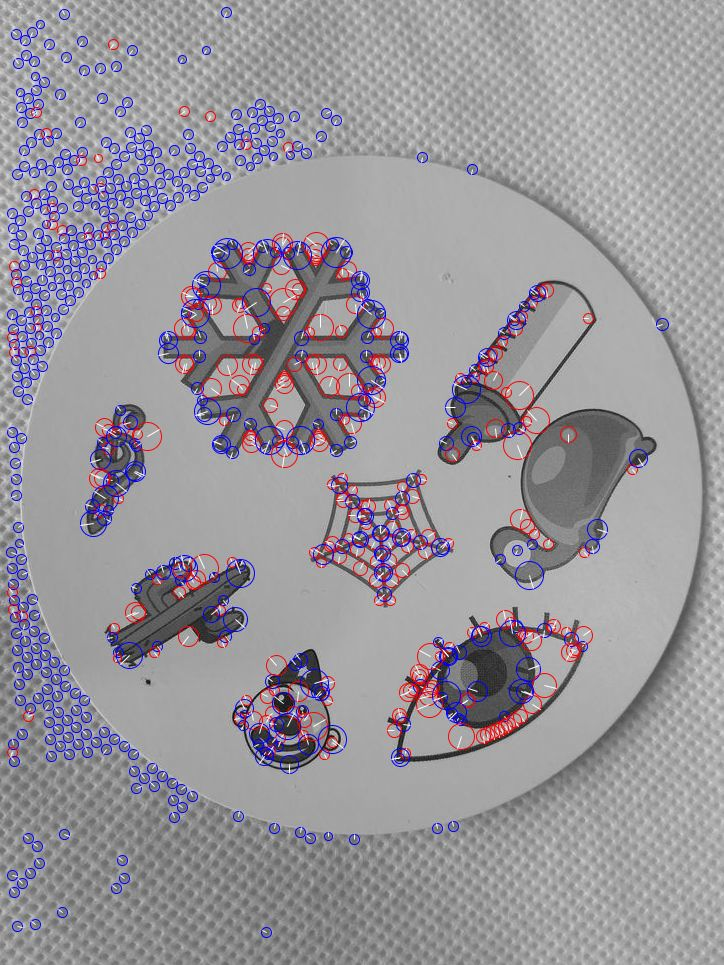

# Pure C# Implementation of SURF (Speeded Up Robust Features)

Find local features using [SURF](https://en.wikipedia.org/wiki/Speeded_up_robust_features)

<a href="assets/clown.png" ></a><br/>
<a href="assets/interest-points-clown.jpg" ></a><br/>

Based on code from:

* https://github.com/mathnet/mathnet-iridium.git
* https://github.com/Erdos001/opensurf1.git

## Prerequisites

* .NET9 SDK

## Getting started

```bash
git clone --recurse-submodules https://github.com/TrevorDArcyEvans/SURF.git
cd SURF
dotnet restore
dotnet build
```

## Usage

```bash
./SURF.UI.CLI --help
SURF.UI.CLI 1.0.0+4a17dd6caa3932375aace673f6d6082142c1d191
Copyright (C) 2025 SURF.UI.CLI

  -o, --octaves           (Default: 2) Number of octaves (min 1, max 5).

  -i, --initialsamples    (Default: 2) Number of initial samples in width & height.

  -t, --threshold         (Default: 0.001) Threshold for point of interest.

  --help                  Display this help screen.

  --version               Display version information.

  value pos. 0            Required. Paths to image files to be processed.
```

Example:

```bash
./SURF.UI.CLI '/home/trevorde/dev/SIFT/assets/phone_cam_06.png' '/home/trevorde/dev/SIFT/assets/phone_cam_06_rot.jpg' '/home/trevorde/dev/SIFT/assets/phone_cam_06_rot_crop.jpg'
```

For each file specified, two files will be generated in the working directory ie:
* interest-points-phone_cam_06.jpg
  * original image file, converted to grayscale with points of interest overlaid
* interest-points-phone_cam_06.json
  * points of interest in JSON format, suitable for further processing eg database import


## Using SURF to recognise features

<details>

### Results

<details>

The following images are from the card game [Dobble](https://en.wikipedia.org/wiki/Dobble).

As seen any two cards have at least one item in common.

<a href="assets/interest-points-phone_cam_15.jpg" ></a><br/>
<a href="assets/interest-points-phone_cam_16.jpg" ></a><br/>
<a href="assets/interest-points-phone_cam_17.jpg" ></a><br/>

</details>

### Further results

<details>

These images have been rotated and cropped

<a href="assets/interest-points-phone_cam_06.jpg" ></a><br/>
<a href="assets/interest-points-phone_cam_06_rot.jpg" ></a><br/>
<a href="assets/interest-points-phone_cam_06_rot_crop.jpg" ></a><br/>

</details>

### Discussion

<details>

#### Effect of `threshold`, `octave` and `initial_samples`

</details>

### Conclusion

<details>

At this stage, SURF shows some promise for feature recognition.

</details>


</details>


## Further information
* feature recognition using [SIFT](https://github.com/TrevorDArcyEvans/SIFT) (Scale Invariant Feature Transform)


## Further work

* ~~support ImageSharp for cross platform support~~
* ~~make parameters accessible from command line~~
